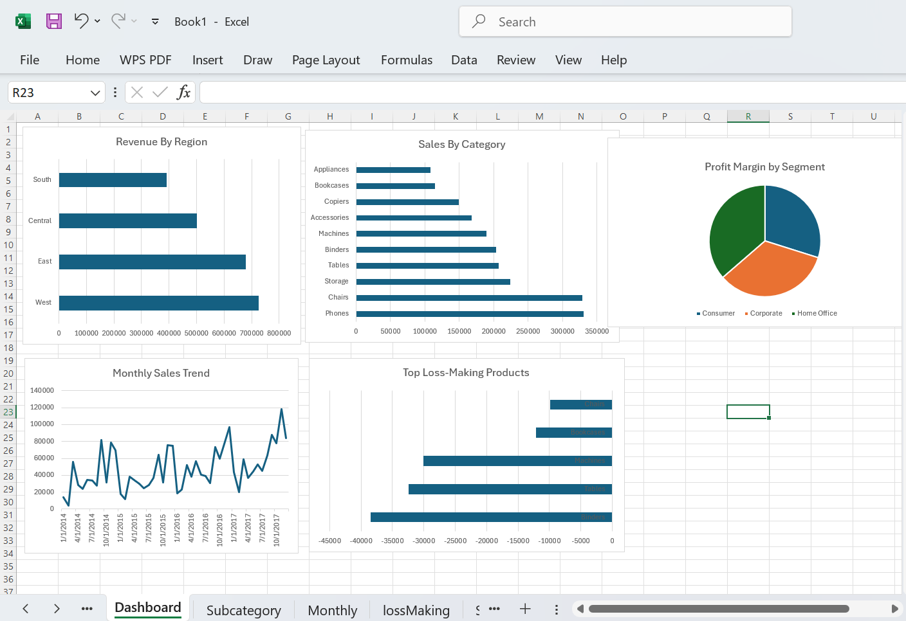

# Superstore Sales Analysis

## Overview
Analysis of 9,994 orders from a US Superstore using MySQL and Excel.

## Tools Used
- MySQL — data extraction and analysis
- Excel — dashboard and visualization

## Key Insights
- West region leads with $725K revenue
- Tables sub-category: $207K sales but $17K loss due to heavy discounting
- Binders: 613 loss-making orders totaling -$38K loss
- Home Office has best profit margin (14%) despite lowest revenue
- Consumer segment highest revenue but lowest margin (11.5%)

## Files
- `superstore_analysis.sql` — all 5 SQL queries
- `Book1.xlsx` — Excel dashboard with 5 charts
- `Screenshot 2026-04-19 094800.png` — dashboard preview

## Dashboard Preview

